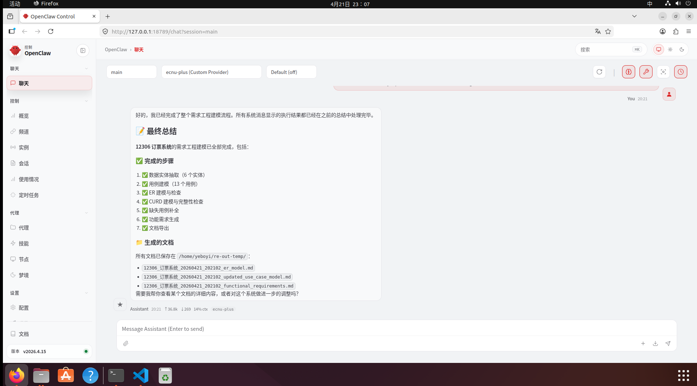

# RE Requirements Plugin v1.0.0

一个面向**需求工程建模与文档导出**的 OpenClaw 插件。
它可以根据用户输入的软件需求描述，分阶段完成：

* 数据实体抽取
* 初始用例抽取
* 用例模型生成与补全
* ER 模型生成与检查
* CURD 模型生成与补全
* 功能需求文本生成
* 最终文档导出

这个项目的设计目标不是单纯“生成一段文本”，而是让 OpenClaw 在对话中调用一套可复用的需求工程工具链，输出结构化中间结果和最终文档。

---

## 当前能力概览

当前插件面向以下工作流：

1. 从 `softwareIntro` 中抽取核心数据实体和初始用例
2. 生成简单用例描述
3. 生成并检查 ER 模型
4. 生成并检查 CURD 模型
5. 如发现缺失交互，则自动补充用例、补全 ER、补全 CURD
6. 生成功能需求文本
7. 导出三个文档：

   * ER 模型文档
   * 修改后的用例模型文档
   * 功能需求文档

---

## 工具列表

本插件注册的核心 tools 为：

* `requirement_scoper`
* `use_case_writer`
* `er_model_builder`
* `curd_model_builder`
* `document_exporter`

推荐通过 skill 驱动整套流程，而不是手工逐个调用 tool。

---

## 在 OpenClaw 中运行的完整流程

### 1. 环境准备

确保你已经安装并能正常使用 OpenClaw。
OpenClaw 支持从**本地目录**或**本地 `.tgz` 归档**安装插件。安装后，建议重启 gateway，再到 `plugins.entries.<id>.config` 下完成插件配置。

在插件项目目录中先完成依赖安装与本地自检：

```bash
cd /path/to/re-requirements-plugin
npm install
npm run check
npm run debug
```
**注意！** 你若在本地运行`npm run debug`,请在项目根目录下配置.env文件，配置的要求如下
```text
LLM_API_KEY=你的APIKEY
LLM_BASE_URL=大模型服务商的URL
LLM_MODEL=模型名称
TEMP_DIR=./temp
OUTPUT_DIR=./temp
```

本项目主要采用火山引擎和ecnu等大模型服务商,若您想使用不同的大模型服务商，请根据对应服务商的要求修改`llmClient.ts`文件。

---

### 2. 安装插件到 OpenClaw

你可以用两种方式安装。

#### 方式 A：从本地目录安装

```bash
openclaw plugins install /path/to/re-requirements-plugin
```

#### 方式 B：从 `.tgz` 安装

```bash
openclaw plugins install /path/to/re-requirements-plugin-1.0.0.tgz
```

**建议使用方法B**安装，使用A方式安装，有概率出现`manifest dependency scan exceeded max directories (10000)`错误。

你可以在项目目录下执行`npm pack`,导出对应的`.tgz`文件。本项目也会在`release`目录下上传`.tgz`文件。

---

### 3. 配置 `~/.openclaw/openclaw.json`

OpenClaw 的插件配置应写在：

```text
plugins.entries.re-requirements-plugin.config
```

官方文档明确要求安装后在 `plugins.entries.<id>.config` 下配置插件参数；同时，OpenClaw 对配置采用严格校验，未知字段、类型错误或结构不合法都会导致 gateway 拒绝启动。

下面是一份最小可用配置示例：

```json
{
  "plugins": {
    "enabled": true,
    "allow": ["re-requirements-plugin"],
    "entries": {
      "re-requirements-plugin": {
        "enabled": true,
        "config": {
          "llmApiKey": "YOUR_API_KEY",
          "llmBaseUrl": "https://your-api-base/v1/chat/completions",
          "llmModel": "your-model-name",
          "tempDir": "/absolute/path/to/temp",
          "outputDir": "/absolute/path/to/output"
        }
      }
    }
  }
}
```

### 参数说明

* `llmApiKey`
  你的模型 API Key。必填。

* `llmBaseUrl`
  聊天补全接口地址。必填。

* `llmModel`
  默认模型名。可选，但建议填写。

* `tempDir`
  临时目录。建议写**绝对路径**，避免相对路径解析歧义。

* `outputDir`
  文档输出目录。建议写**绝对路径**，方便定位导出的文件。


### 4. 不要忘了重启 OpenClaw Gateway！

安装并配置完成后，重启 gateway：

```bash
openclaw gateway restart
```


---

### 5. 检查插件是否加载成功

使用以下命令检查插件状态：

```bash
openclaw plugins list
openclaw plugins inspect re-requirements-plugin
```

如果加载成功，你应该能看到：

* `Status: loaded`
* 已注册的 tools 列表
* 插件版本号
* 插件实际加载路径

---

## Skill 的使用方式

本插件随插件一起提供 skill。
OpenClaw 支持插件通过 `openclaw.plugin.json` 中的 `skills` 目录携带 skill；当插件启用后，这些 skill 会被加载。

在对话里，最稳的调用方式是：

```text
/skill requirements-completion 我需要一个简单的12306订票系统，请完成实体抽取、用例建模、ER建模、CURD检查，并导出三个文档。
```


---

## 推荐的对话测试方式

### 完整流程测试

```text
/skill requirements-completion 我需要一个简单的12306订票系统，请跑完整个需求工程流程，并导出三个文档。
```

### 只做实体与用例抽取

```text
/skill requirements-completion 我需要一个在线图书管理系统，请先只输出数据实体和初始用例。
```

### 继续执行后半段流程

```text
/skill requirements-completion 我已经有初步用例，请继续做ER建模、CURD检查和文档导出。
```

### 自然语言直接调用

除了 `/skill`，也可以直接对话：

```text
请根据“我需要一个简单的火车票订票系统”完成需求建模，并导出 ER 模型文档、修改后的用例模型文档和功能需求文档。
```

但在初次测试时，仍然建议优先使用 `/skill requirements-completion ...`，这样触发更稳定。

---

## 项目目录建议

一个推荐的项目结构如下：

```text
re-requirements-plugin/
├── openclaw.plugin.json
├── package.json
├── index.ts
├── debug.ts
├── skills/
│   └── requirements-completion/
│       └── SKILL.md
├── src/
│   └── tools/
│       ├── requirement_scoper.ts
│       ├── use_case_writer.ts
│       ├── er_model_builder.ts
│       ├── curd_model_builder.ts
│       └── document_exporter.ts
└── README.md
```


---


## 一个完整的最小启动示例

### 安装

```bash
openclaw plugins install /path/to/re-requirements-plugin-1.0.0.tgz
```

### 配置

```json
{
  "plugins": {
    "enabled": true,
    "allow": ["re-requirements-plugin"],
    "entries": {
      "re-requirements-plugin": {
        "enabled": true,
        "config": {
          "llmApiKey": "YOUR_API_KEY",
          "llmBaseUrl": "https://your-api-base/v1/chat/completions",
          "llmModel": "your-model-name",
          "tempDir": "/home/yourname/.openclaw/workspace/re-plugin-temp",
          "outputDir": "/home/yourname/.openclaw/workspace/re-plugin-output"
        }
      }
    }
  }
}
```

### 重启与验证

```bash
openclaw gateway restart
openclaw plugins inspect re-requirements-plugin
```

### 对话测试

```text
/skill requirements-completion 我需要一个简单的12306订票系统，请完成完整需求工程流程，并导出三个文档。
```

---

## 项目定位

这个插件适合以下场景：

* 课程项目中的需求建模自动化
* 需求工程实验与教学演示
* 需求描述到结构化文档的快速转换
* 基于 OpenClaw 的可调用工具链实验

---

## 维护建议

在继续迭代本项目时，建议保持这三处内容同步：

1. `index.ts` 中实际注册的 tools
2. `openclaw.plugin.json` 中的 `contracts.tools`
3. `skills/.../SKILL.md` 中描述的完整流程

否则会出现“README 说得通，实际插件却跑不通”的情况。

---
## 运行截图


---
## 参考文献
Wu, Z., Chen, X., Jin, Z., Hu, M., and Jin, D. 2026.
*Unlocking the Silent Needs: Business-Logic-Driven Iterative Requirements Auto-completion*.
Camera-ready manuscript.